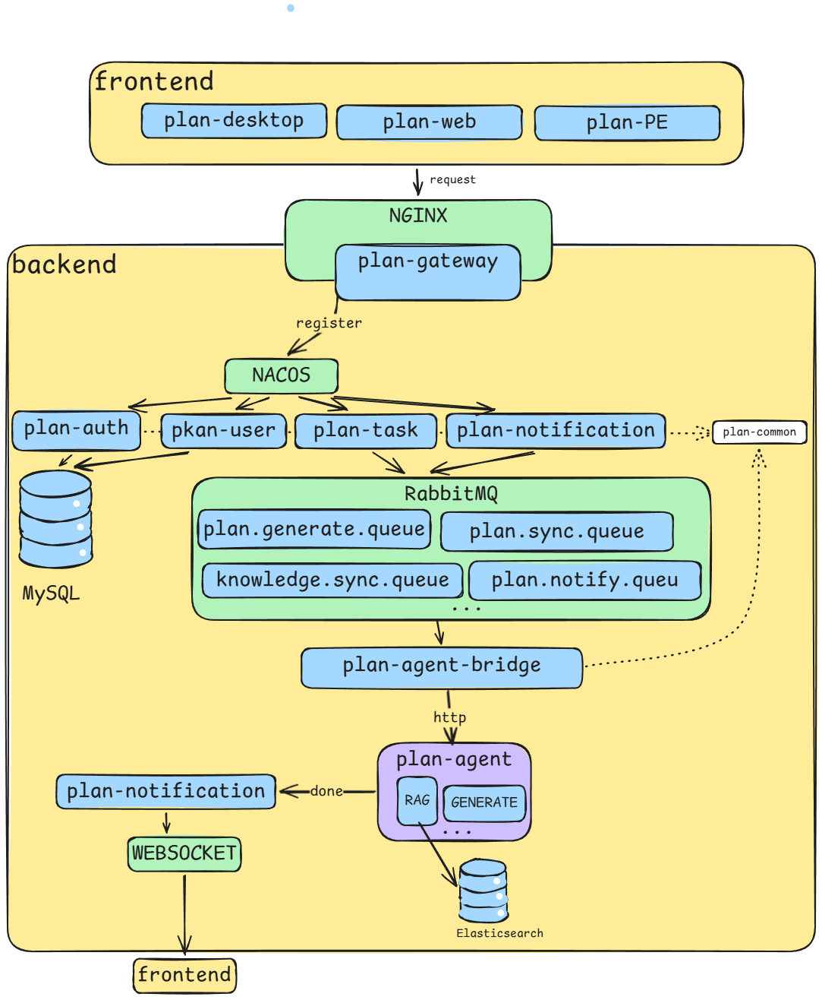

# PlanGoDaily (PGO)

A daily planning assistant powered by LLM.

## A Personal Note

This is my first formal project after graduating from college. Even though it's just a small system, it means a lot to me.

Anyway, PlanGoDaily (PGO) is a simple system for planning — kind of like a to‑do list, but driven by AI. I drew inspiration from my final year project, using Python for the agent and Java for the backend services.

## Tech Stack – 2026.06.27

This is a distributed microservices project.

- **Backend:** Java 21 (Virtual Threads) + Spring Boot 3 + Spring Cloud + FastAPI
- **Service Discovery & Config:** Nacos
- **Message Queue:** RabbitMQ
- **Database:** MySQL 8.0
- **Cache & Distributed Lock:** Redis + Redisson
- **Task Scheduling:** XXL-JOB
- **Search Engine:** Elasticsearch
- **Real-time Push:** WebSocket
- **Observability:** Prometheus + Grafana + Micrometer Tracing
- **Containerization:** Docker



## How to start – 2026.06.28

### 1. Start all middleware containers
Make sure you have **Docker Desktop** installed (Windows / Linux / macOS).
Open a terminal (PowerShell, bash, etc.) in the project root directory where `docker-compose.yml` is located, then run:

```bash
docker compose up -d
```
This will pull all required images and start Nacos, MySQL, Redis, RabbitMQ, etc.
After the containers are up, you can visit http://localhost:8848/nacos to access the Nacos console (default account: nacos/nacos).

### 2. Launch all microservices
**Option A – Using IntelliJ IDEA (recommended)**

**Option B – Using command line**
```bash
# plan-gateway (port 8080)
cd plan-gateway && mvn spring-boot:run

# plan-auth (port 8081)
cd plan-auth && mvn spring-boot:run

# plan-user (port 8082)
cd plan-user && mvn spring-boot:run

# plan-task (port 8083)
cd plan-task && mvn spring-boot:run

# plan-notification (port 8084)
cd plan-notification && mvn spring-boot:run

# plan-agent-bridge (port 8085)
cd plan-agent-bridge && mvn spring-boot:run
```