# PlanGoDaily (PGO)

这是一个由Agent接管的每日计划生成平台

## 开发者言

这是我大学毕业后的第一个个人项目，对我意义重大，我希望它可以好好长大，顺利杀青。
PGO是从TODOLIST中产生的，结合上Agent技术补全的，让它可以做到寻常TODOLIST做不到的事情：我希望它不仅仅是为用户服务，也可以为其他智能体服务。
比如在为用户生成一份工作计划后，调用环境内其他Agent，给他们安排任务并执行，让用户可以看见自己的计划被自动执行等等。

## 技术栈 – 2026.06.27

项目采用微服务设计

- **Backend:** Java 21 (Virtual Threads) + Spring Boot 3 + Spring Cloud + FastAPI
- **Service Discovery & Config:** Nacos
- **Message Queue:** RabbitMQ
- **Database:** MySQL 8.0
- **Cache & Distributed Lock:** Redis + Redisson
- **Task Scheduling:** XXL-JOB
- **Search Engine:** Elasticsearch
- **Real-time Push:** WebSocket
- **Observability:** Prometheus + Grafana + Micrometer Tracing
- **Containerization:** Docker

```mermaid
graph TD
    %% 样式全局美化
    classDef client fill:#e6f7ff,stroke:#1890ff,stroke-width:3px,color:#000000
    classDef gateway fill:#fff7e6,stroke:#fa8c16,stroke-width:3px,color:#000000
    classDef registry fill:#f0f2f5,stroke:#8c8c8c,stroke-width:3px,color:#000000
    classDef javaService fill:#f9e8ff,stroke:#eb2f96,stroke-width:3px,color:#000000
    classDef agent fill:#e6ffe6,stroke:#52c41a,stroke-width:3px,color:#000000
    classDef middleware fill:#fff2e8,stroke:#ff7a45,stroke-width:3px,color:#000000
    classDef monitor fill:#f0f8ff,stroke:#2f54eb,stroke-width:3px,color:#000000
    classDef storage fill:#fffbf0,stroke:#faad14,stroke-width:3px,color:#000000

    %% ========== 1. 客户端接入层 ==========
    subgraph 客户端接入层
        Client["📱🖥️ 前端客户端"]:::client
    end

    %% ========== 2. 网关 & 注册配置中心 ==========
    subgraph 网关注册层
        Gateway["🚪 API Gateway<br/>Spring Cloud Gateway"]:::gateway
        Nacos["🧭 Nacos<br/>注册中心+配置中心"]:::registry
    end

    %% ========== 3. Java 微服务业务集群 ==========
    subgraph Java微服务集群
        Auth["🔐 plan-auth 认证服务"]:::javaService
        User["👤 plan-user 用户服务"]:::javaService
        Task["📋 plan-task 计划核心服务"]:::javaService
        Notify["🔔 plan-notification 通知服务"]:::javaService
        Bridge["🤖 plan-agent-bridge 智能体桥接"]:::javaService
    end

    %% ========== 4. AI 智能体服务 ==========
    subgraph AI智能体层
        Agent["🐍 Python Agent<br/>LangGraph + FastAPI"]:::agent
    end

    %% ========== 5. 存储组件 ==========
    subgraph 持久化存储
        MySQL[("🗄️ MySQL 8.0 业务库")]:::storage
        Redis[("⚡ Redis<br/>缓存/分布式锁")]:::storage
        ES[("🔍 Elasticsearch 检索引擎")]:::storage
    end

    %% ========== 6. 消息与调度中间件 ==========
    subgraph 消息&调度中间件
        RabbitMQ[("📬 RabbitMQ 消息队列")]:::middleware
        XXL["⏰ XXL-JOB 分布式定时任务"]:::middleware
    end

    %% ========== 7. 可观测监控体系 ==========
    subgraph 监控链路体系
        Prometheus[("📊 Prometheus 指标采集")]:::monitor
        Grafana[("📈 Grafana 可视化大盘")]:::monitor
        Trace["🔗 Micrometer+Zipkin 链路追踪"]:::monitor
    end

    %% ===================== 业务流向连线 =====================
    %% 客户端访问网关
    Client --> Gateway

    %% 网关服务发现
    Gateway -.->|服务发现拉取| Nacos

    %% 网关路由分发
    Gateway --> Auth
    Gateway --> User
    Gateway --> Task
    Gateway --> Notify

    %% 所有微服务注册到Nacos
    Auth -.->|服务注册上报| Nacos
    User -.->|服务注册上报| Nacos
    Task -.->|服务注册上报| Nacos
    Notify -.->|服务注册上报| Nacos
    Bridge -.->|服务注册上报| Nacos

    %% 微服务同步调用
    Task -->|Token校验| Auth
    Task -->|查询用户配置| User
    Bridge -->|回写任务状态| Task

    %% MQ 异步消息链路
    Task -->|下发AI生成任务| RabbitMQ
    Bridge -->|消费AI任务| RabbitMQ
    Bridge -->|推送通知事件| RabbitMQ
    Bridge -->|同步检索数据| RabbitMQ
    Task -->|同步索引数据| RabbitMQ
    Notify -->|消费通知事件| RabbitMQ

    %% AI 桥接调用Python智能体
    Bridge -->|HTTP REST调用| Agent

    %% 通知推送前端
    Notify -->|WebSocket实时推送| Gateway

    %% 数据持久化存储
    Auth --> MySQL
    User --> MySQL
    Task --> MySQL
    Task --> Redis
    Bridge --> ES
    Notify --> Redis

    %% 定时任务驱动业务
    XXL -->|定时扫描待提醒任务| Task

    %% 监控指标上报（虚线）
    Auth -.->|暴露Metrics指标| Prometheus
    User -.->|暴露Metrics指标| Prometheus
    Task -.->|暴露Metrics指标| Prometheus
    Notify -.->|暴露Metrics指标| Prometheus
    Bridge -.->|暴露Metrics指标| Prometheus
    Agent -.->|暴露Metrics指标| Prometheus

    %% 监控展示与链路追踪
    Prometheus --> Grafana
    Auth -.->|链路埋点上报| Trace
    User -.->|链路埋点上报| Trace
    Task -.->|链路埋点上报| Trace
    Notify -.->|链路埋点上报| Trace
    Bridge -.->|链路埋点上报| Trace
```



## How to start – 2026.06.28

### 1. Start all middleware containers
Make sure you have **Docker Desktop** installed (Windows / Linux / macOS).
Open a terminal (PowerShell, bash, etc.) in the project root directory where `docker-compose.yml` is located, then run:

```bash
docker compose up -d
```
This will pull all required images and start Nacos, MySQL, Redis, RabbitMQ, etc.
After the containers are up, you can visit http://localhost:8848/nacos to access the Nacos console (default account: nacos/nacos).

### 2. Launch all microservices
**Option A – Using IntelliJ IDEA (recommended)**

**Option B – Using command line**
```bash
# plan-gateway (port 8080)
cd plan-gateway && mvn spring-boot:run

# plan-auth (port 8081)
cd plan-auth && mvn spring-boot:run

# plan-user (port 8082)
cd plan-user && mvn spring-boot:run

# plan-task (port 8083)
cd plan-task && mvn spring-boot:run

# plan-notification (port 8084)
cd plan-notification && mvn spring-boot:run

# plan-agent-bridge (port 8085)
cd plan-agent-bridge && mvn spring-boot:run
```